# 04 — Flowcharts & State Machines

All diagrams are Mermaid. They render in GitHub, VS Code (with the Mermaid extension), and
most Markdown viewers.

---

## 1. System architecture

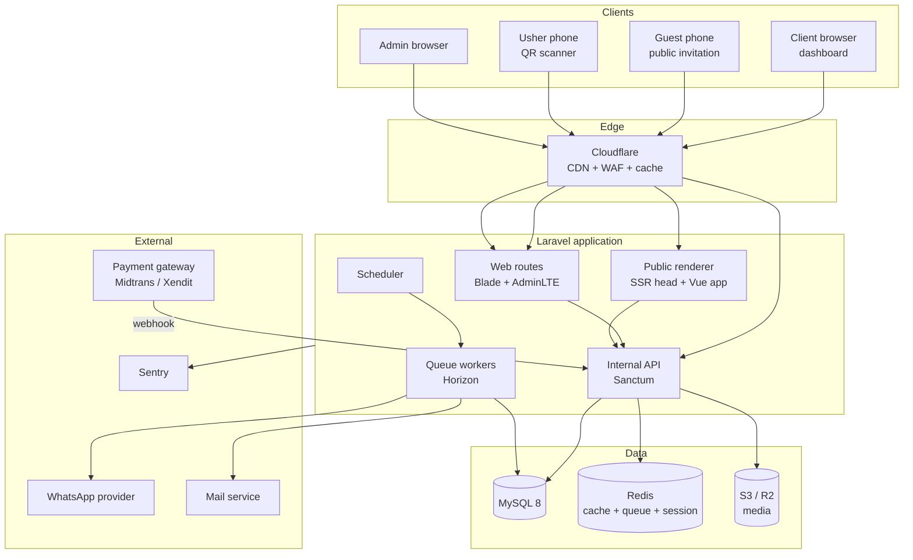

---

## 2. Client journey — purchase to published

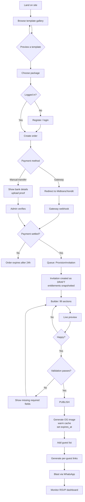

---

## 3. Guest journey

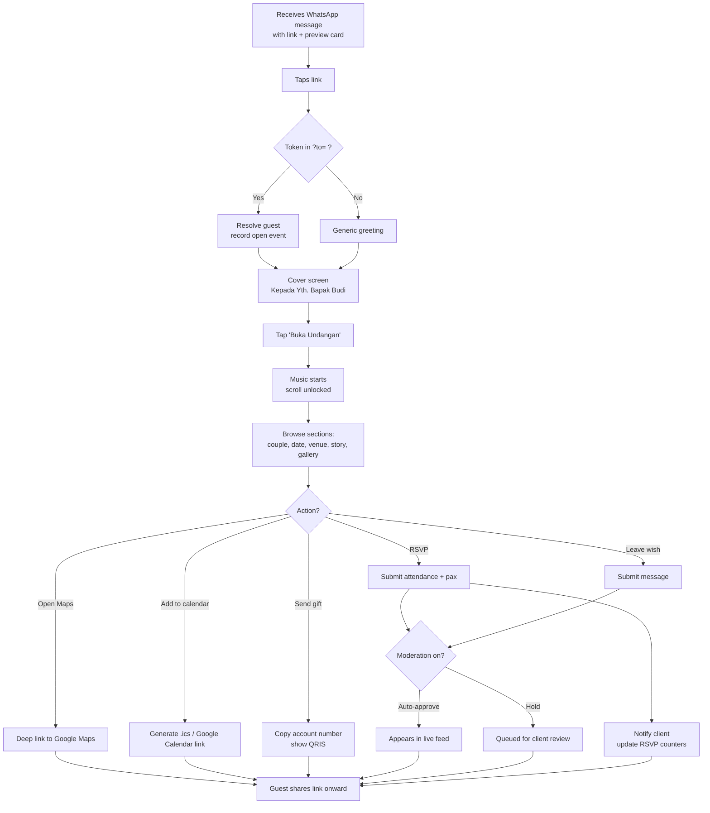

---

## 4. Invitation lifecycle state machine

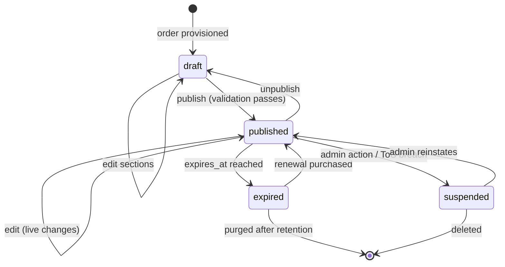

**Publish validation gate (must all pass):**

| Check | Rule |
|---|---|
| Slug | Set, unique, not in blocklist |
| Persons | At least one, matching the event type's required roles |
| Event session | At least one with `start_at` and `venue_name` |
| Cover | Cover image set |
| Template | Published, and within the invitation's package tier |
| Quotas | Media count and storage within entitlements |
| Order | Status is `paid` or `provisioned` |

**On publish, queue these jobs:** generate OG image → warm public cache → schedule expiry
warnings (H-7, H-1) → send "your invitation is live" notification.

---

## 5. Payment & webhook sequence

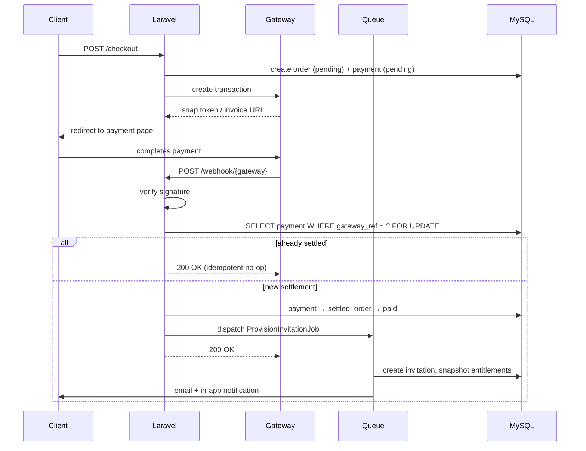

**Rules:**
- Verify the signature before touching the database. Always.
- Return `200` even for duplicate deliveries, or the gateway will retry forever.
- Never provision inline in the webhook handler — gateways time out at ~5–10s.
- Log the raw payload to `payments.raw_payload` before processing, so a dispute is arguable.
- Reconcile daily against the gateway's settlement report; webhooks do get lost.

---

## 6. Guest import flow

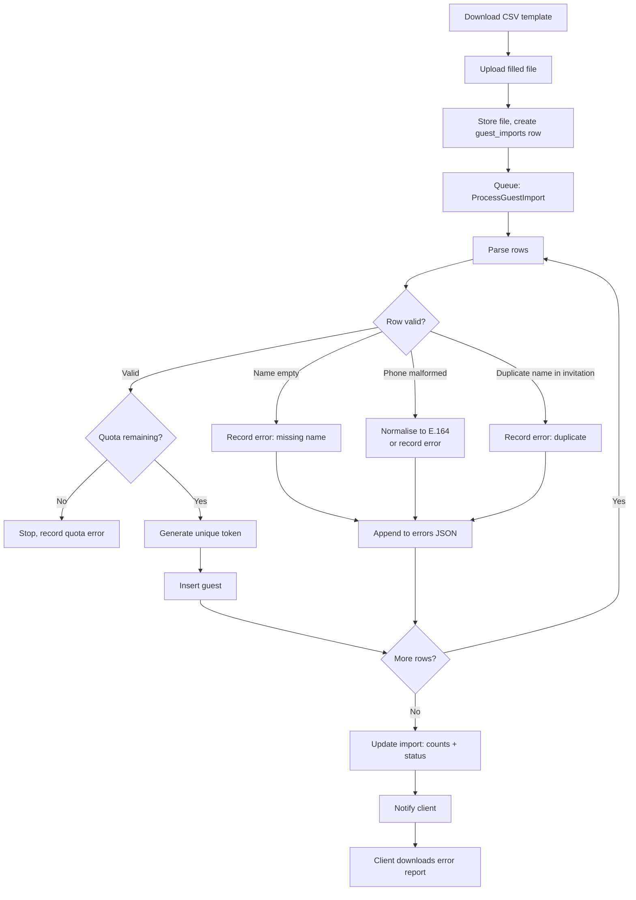

**Batch insert.** 500 individual `INSERT`s is slow enough that clients will refresh and
re-upload. Chunk into batches of 100.

---

## 7. WhatsApp blast flow

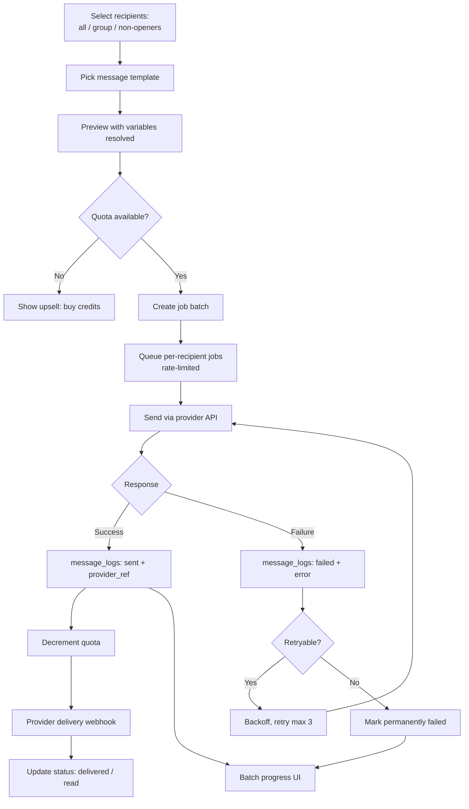

**Rate limiting is mandatory.** Blasting 400 messages at full speed is the fastest way to get
a number flagged. Throttle to a conservative per-minute rate and spread the batch.

---

## 8. QR check-in flow

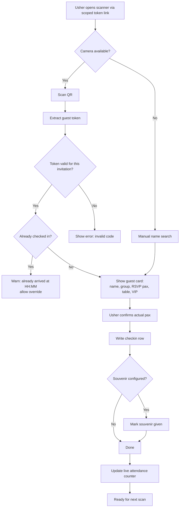

---

## 9. Affiliate commission flow

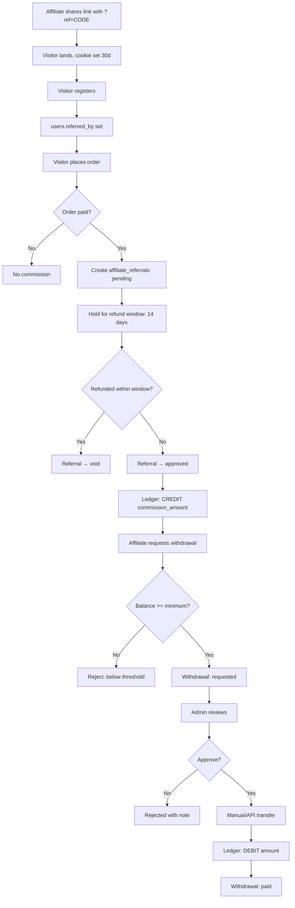

**The hold window matters.** Paying commission immediately on a paid order means refunds
create negative balances and awkward clawbacks. Hold until the refund window closes.

---

## 10. Public invitation request path (performance-critical)

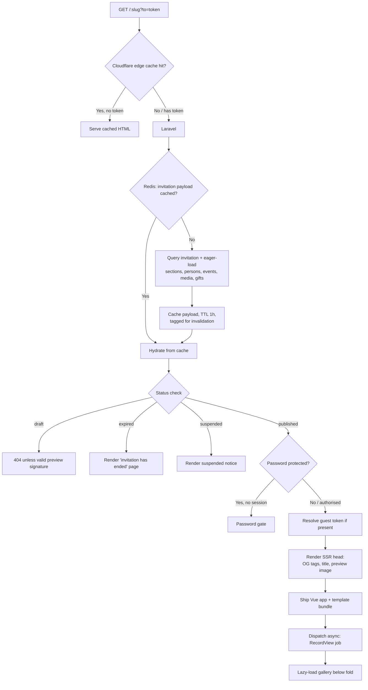

**Cache invalidation:** bust the invitation's cache tag on any write to the invitation or any
of its child tables. Use a model observer on each child so nobody has to remember.

---

## 11. Role & permission matrix

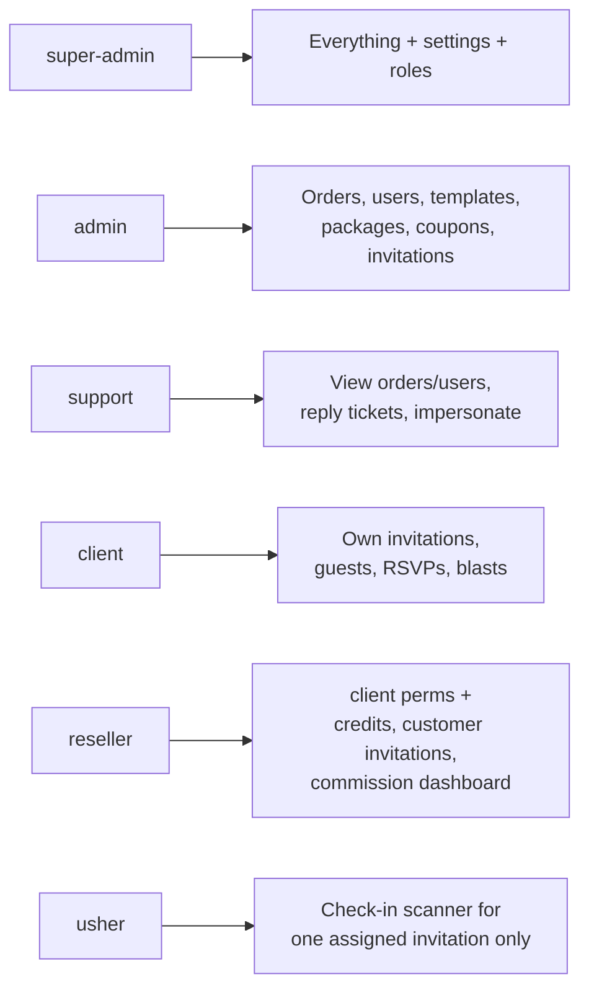

| Permission group | super-admin | admin | support | client | reseller | usher |
|---|:--:|:--:|:--:|:--:|:--:|:--:|
| Manage settings & roles | ✅ | — | — | — | — | — |
| Manage templates/packages | ✅ | ✅ | — | — | — | — |
| Manage all orders | ✅ | ✅ | 👁 | — | — | — |
| Verify manual payments | ✅ | ✅ | — | — | — | — |
| Manage all users | ✅ | ✅ | 👁 | — | — | — |
| Impersonate client | ✅ | ✅ | ✅ | — | — | — |
| Own invitations CRUD | ✅ | ✅ | — | ✅ | ✅ | — |
| Guest list CRUD | ✅ | ✅ | — | ✅ | ✅ | — |
| Send blasts | ✅ | ✅ | — | ✅ | ✅ | — |
| Check-in scanner | ✅ | ✅ | — | ✅ | ✅ | ✅ |
| Affiliate dashboard | ✅ | 👁 | — | — | ✅ | — |
| Approve withdrawals | ✅ | ✅ | — | — | — | — |

👁 = read-only
