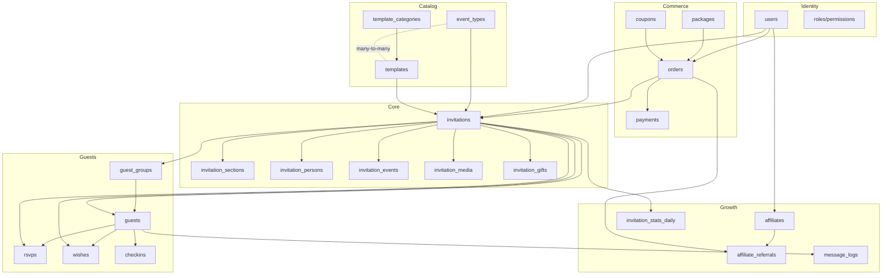
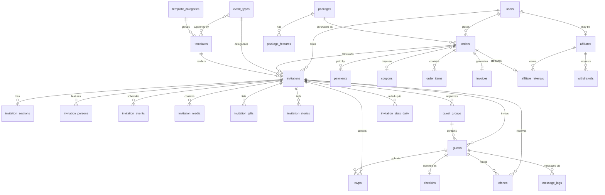

# 03 — Database Design & ERD

MySQL 8 / MariaDB 10.6+. All tables `utf8mb4_unicode_ci`. All PKs `BIGINT UNSIGNED AUTO_INCREMENT`
unless noted. Soft deletes on user-owned content (`invitations`, `guests`, `templates`),
hard deletes on logs and pivots.

---

## 1. High-level domain map



---

## 2. Core ERD



---

## 3. Table specifications

### 3.1 Identity

#### `users`
| Column | Type | Notes |
|---|---|---|
| id | bigint PK | |
| name | varchar(150) | |
| email | varchar(190) | unique |
| email_verified_at | timestamp null | |
| phone | varchar(30) | unique, E.164 normalised |
| phone_verified_at | timestamp null | |
| password | varchar(255) | |
| avatar | varchar(255) null | |
| status | enum | `active`, `suspended`, `banned` — default `active` |
| referred_by | bigint null FK → affiliates.id | attribution at signup |
| last_login_at | timestamp null | |
| timestamps, softDeletes | | |

Indexes: `email`, `phone`, `status`, `referred_by`

Plus Spatie tables: `roles`, `permissions`, `model_has_roles`, `model_has_permissions`,
`role_has_permissions`.

---

### 3.2 Commerce

#### `packages`
| Column | Type | Notes |
|---|---|---|
| id | bigint PK | |
| name | varchar(100) | |
| slug | varchar(120) | unique |
| description | text null | |
| price | decimal(12,2) | |
| discount_price | decimal(12,2) null | |
| currency | char(3) | default `IDR` |
| active_days | smallint | how long the invitation stays live after publish |
| is_featured | boolean | |
| is_active | boolean | |
| sort_order | smallint | |
| timestamps | | |

#### `package_features`
| Column | Type | Notes |
|---|---|---|
| id | bigint PK | |
| package_id | bigint FK cascade | |
| feature_key | varchar(60) | `max_guests`, `max_photos`, `whatsapp_quota`, `custom_domain`, … |
| feature_value | varchar(100) null | numeric-as-string or `true`/`false` |
| is_unlimited | boolean | |

Unique: (`package_id`, `feature_key`)

> **Design note:** feature flags as rows (not columns) means adding a new capability is a
> seed, not a migration. Resolve them into a typed DTO/value object at runtime and cache it.

#### `orders`
| Column | Type | Notes |
|---|---|---|
| id | bigint PK | |
| order_number | varchar(40) | unique, human-readable e.g. `UDY-20260910-0001` |
| user_id | bigint FK | |
| package_id | bigint FK restrict | |
| template_id | bigint null FK | chosen at checkout, changeable later |
| coupon_id | bigint null FK | |
| subtotal | decimal(12,2) | |
| discount_amount | decimal(12,2) | default 0 |
| tax_amount | decimal(12,2) | default 0 |
| total | decimal(12,2) | |
| status | enum | `pending`, `paid`, `provisioned`, `expired`, `cancelled`, `refunded` |
| payment_deadline | timestamp null | |
| paid_at | timestamp null | |
| notes | text null | |
| timestamps | | |

Indexes: `user_id`, `status`, `order_number`, (`status`,`payment_deadline`)

#### `order_items`
Polymorphic line items so add-ons work without schema change.

| Column | Type | Notes |
|---|---|---|
| id | bigint PK | |
| order_id | bigint FK cascade | |
| itemable_type / itemable_id | morphs | Package, Template, AddOn |
| name | varchar(150) | snapshot at purchase time |
| unit_price | decimal(12,2) | snapshot |
| quantity | int | |
| total | decimal(12,2) | |
| meta | json null | |

> Snapshot name and price. If you later change a package's price, historical orders must not
> silently change. This is non-negotiable for accounting.

#### `payments`
| Column | Type | Notes |
|---|---|---|
| id | bigint PK | |
| order_id | bigint FK cascade | |
| gateway | varchar(40) | `midtrans`, `xendit`, `manual` |
| gateway_ref | varchar(190) null | **unique** — idempotency key for webhooks |
| method | varchar(50) null | `bca_va`, `qris`, `gopay`, `card`, `bank_transfer` |
| amount | decimal(12,2) | |
| status | enum | `pending`, `settled`, `failed`, `expired`, `refunded` |
| proof_path | varchar(255) null | manual transfer proof upload |
| verified_by | bigint null FK users | manual verification |
| verification_note | varchar(500) null | why an admin approved or rejected — a rejection has to tell the client what to fix |
| verified_at | timestamp null | when that decision was made |
| paid_at | timestamp null | |
| raw_payload | json null | full gateway response, for disputes |
| timestamps | | |

Indexes: unique `gateway_ref`, `order_id`, `status`

#### `coupons`
`id`, `code` (unique), `type` enum(`percent`,`fixed`), `value` decimal, `min_order` decimal null,
`max_discount` decimal null, `max_uses` int null, `max_uses_per_user` int null, `used_count` int,
`applicable_packages` json null, `starts_at`, `ends_at`, `is_active`, timestamps.

#### `coupon_redemptions`
`id`, `coupon_id` FK, `user_id` FK, `order_id` FK, `discount_amount`, `redeemed_at`.
Unique: (`coupon_id`,`order_id`).

#### `invoices`
`id`, `order_id` FK, `invoice_number` unique, `pdf_path`, `issued_at`, `due_at`, timestamps.

---

### 3.3 Catalog

#### `event_types`
| Column | Type | Notes |
|---|---|---|
| id | bigint PK | |
| name | varchar(80) | Pernikahan, Ulang Tahun, Aqiqah, Khitanan, Wisuda, Corporate |
| slug | varchar(80) unique | |
| icon | varchar(60) null | |
| person_roles | json | `["bride","groom"]` or `["celebrant"]` — drives M4.3 |
| default_sections | json | ordered section keys enabled by default |
| is_active | boolean | |
| sort_order | smallint | |
| timestamps | | |

Index: (`is_active`, `sort_order`) — every client-facing list filters and orders on exactly
those two columns.

#### `template_categories`
`id`, `name`, `slug` unique, `description` null, `sort_order`, `is_active`, timestamps.
Index: (`is_active`, `sort_order`), same reason as above.

#### `templates`
| Column | Type | Notes |
|---|---|---|
| id | bigint PK | |
| template_category_id | bigint FK | |
| name | varchar(120) | |
| slug | varchar(140) unique | |
| description | text null | |
| thumbnail | varchar(255) | |
| view_key | varchar(100) | maps to the Vue component / Blade view that renders it |
| version | varchar(20) | semver, e.g. `1.2.0` |
| min_package_id | bigint null FK | tier gate |
| config_schema | json | which colours/fonts/toggles are exposed to the client |
| default_config | json | |
| demo_data | json null | powers the public preview (M3.6) |
| is_premium | boolean | |
| extra_price | decimal(12,2) | 0 if included in tier |
| status | enum | `draft`, `published`, `archived` |
| usage_count | int | denormalised, for sorting by popularity |
| sort_order | smallint | |
| timestamps, softDeletes | | |

#### `template_screenshots`
`id`, `template_id` FK cascade, `path`, `caption` null, `sort_order`.

#### `event_type_template` (pivot)
`event_type_id`, `template_id`. Composite PK.

---

### 3.4 Core invitation

#### `invitations`
The central table. Keep it lean — variable content lives in child tables and JSON.

| Column | Type | Notes |
|---|---|---|
| id | bigint PK | |
| uuid | char(36) unique | for external references |
| user_id | bigint FK | owner |
| created_by | bigint null FK users | differs from owner when a reseller creates it |
| order_id | bigint null FK | |
| event_type_id | bigint FK | |
| template_id | bigint FK | |
| template_version | varchar(20) | **pinned** — see M3.9 |
| package_id | bigint FK | snapshot of entitlements source |
| slug | varchar(120) | **unique**, blocklist-checked |
| custom_domain | varchar(190) null | unique, nullable |
| title | varchar(190) | internal label |
| status | enum | `draft`, `published`, `expired`, `suspended` |
| visibility | enum | `public`, `unlisted`, `password` |
| password | varchar(255) null | hashed |
| language | char(5) | default `id` |
| timezone | varchar(64) | default `Asia/Jakarta` |
| theme_config | json null | per-invitation overrides within `config_schema` bounds |
| settings | json | feature toggles: rsvp_enabled, guestbook_enabled, music_enabled, moderation mode, etc. |
| entitlements | json | resolved package limits snapshotted at provision time |
| meta_title | varchar(190) null | |
| meta_description | varchar(300) null | |
| og_image_path | varchar(255) null | auto-generated (M12.7) |
| view_count | int unsigned | denormalised counter |
| published_at | timestamp null | |
| expires_at | timestamp null | |
| timestamps, softDeletes | | |

Indexes: unique `slug`, unique `custom_domain`, unique `uuid`, `user_id`,
(`status`,`expires_at`), `event_type_id`, `template_id`

> **Why `entitlements` is snapshotted:** if you change what "Premium" includes next year,
> already-purchased invitations must keep what they were sold. Resolve package features into
> this JSON at provisioning time and read limits from here, never from the live package.

#### `invitation_sections`
Drives ordering and visibility of the flexible block system (M4.11).

| Column | Type | Notes |
|---|---|---|
| id | bigint PK | |
| invitation_id | bigint FK cascade | |
| section_key | varchar(60) | `cover`, `persons`, `events`, `story`, `gallery`, `gifts`, `rsvp`, `guestbook`, `quote`, `custom` |
| title | varchar(150) null | client-overridable heading |
| content | json null | for `custom` sections and per-section copy |
| is_visible | boolean | |
| sort_order | smallint | |

Unique: (`invitation_id`, `section_key`, `sort_order`) — or just index (`invitation_id`,`sort_order`).

Built with both: the unique on all three columns, plus the (`invitation_id`,`sort_order`) index
every read uses. The unique covers the sort order rather than the key alone because `custom`
sections repeat within one invitation.

#### `invitation_persons`
| Column | Type | Notes |
|---|---|---|
| id | bigint PK | |
| invitation_id | bigint FK cascade | |
| role | varchar(40) | validated against `event_types.person_roles` |
| full_name | varchar(190) | |
| nickname | varchar(80) null | |
| photo | varchar(255) null | |
| bio | text null | |
| parent_father | varchar(190) null | |
| parent_mother | varchar(190) null | |
| child_order | varchar(50) null | "Putri pertama dari…" |
| instagram | varchar(100) null | |
| sort_order | smallint | |

#### `invitation_events`
An invitation has many sessions (Akad + Resepsi, or Day 1 + Day 2).

| Column | Type | Notes |
|---|---|---|
| id | bigint PK | |
| invitation_id | bigint FK cascade | |
| name | varchar(120) | Akad Nikah, Resepsi |
| description | text null | |
| start_at | datetime | store UTC, render in invitation timezone |
| end_at | datetime null | |
| is_all_day | boolean | |
| venue_name | varchar(190) | |
| address | text null | |
| maps_url | varchar(500) null | |
| latitude | decimal(10,7) null | |
| longitude | decimal(10,7) null | |
| dress_code | varchar(190) null | |
| live_stream_url | varchar(500) null | |
| notes | text null | |
| sort_order | smallint | |

#### `invitation_stories`
`id`, `invitation_id` FK cascade, `date` date null, `title`, `description` text null,
`image` null, `sort_order`.

#### `invitation_media`
| Column | Type | Notes |
|---|---|---|
| id | bigint PK | |
| invitation_id | bigint FK cascade | |
| type | enum | `image`, `video`, `audio` |
| source | enum | `upload`, `embed`, `library` |
| disk | varchar(30) null | |
| path | varchar(500) null | |
| embed_url | varchar(500) null | YouTube/Vimeo |
| thumbnail | varchar(500) null | |
| conversions | json null | `{thumb, medium, webp, og}` paths |
| caption | varchar(255) null | |
| file_size | int unsigned null | bytes, for quota accounting |
| is_cover | boolean | |
| sort_order | smallint | |

#### `invitation_gifts`
| Column | Type | Notes |
|---|---|---|
| id | bigint PK | |
| invitation_id | bigint FK cascade | |
| type | enum | `bank`, `ewallet`, `qris`, `address` |
| provider_name | varchar(100) null | BCA, Mandiri, GoPay, OVO |
| account_name | varchar(190) null | |
| account_number | text null | **encrypted at rest** — `text`, not `varchar(100)`: the column holds ciphertext, which is several times longer than the account number it wraps |
| qris_image | varchar(255) null | |
| recipient_name | varchar(190) null | for `address` type |
| address | text null | |
| notes | varchar(255) null | |
| sort_order | smallint | |

> `account_number` holds the client's own bank details for display. Use Laravel's
> `encrypted` cast. It is displayed publicly by design, but encrypting at rest limits
> blast radius if the DB leaks, and keeps a bulk-scrape of every client's banking
> details off the table.

---

### 3.5 Guests & responses

#### `guest_groups`
`id`, `invitation_id` FK cascade, `name` varchar(100), `color` varchar(20) null,
`sort_order`, timestamps.

#### `guests`
| Column | Type | Notes |
|---|---|---|
| id | bigint PK | |
| invitation_id | bigint FK cascade | |
| guest_group_id | bigint null FK set null | |
| title | varchar(30) null | Bapak / Ibu / Saudara / Saudari |
| name | varchar(190) | |
| phone | varchar(30) null | E.164 |
| email | varchar(190) null | |
| address | text null | |
| token | varchar(80) | **unique**, URL-safe slug — the `?to=` value |
| max_pax | tinyint | default 2 |
| is_vip | boolean | |
| table_number | varchar(20) null | |
| notes | text null | |
| sent_at | timestamp null | |
| opened_at | timestamp null | first open |
| open_count | int unsigned | |
| timestamps, softDeletes | | |

Indexes: unique `token`, (`invitation_id`,`name`), `guest_group_id`, (`invitation_id`,`opened_at`)

> **Token generation:** slugified name + short random suffix (`budi-santoso-x7f2`). Readable
> in the URL, but not enumerable. Never expose the numeric ID.

#### `rsvps`
| Column | Type | Notes |
|---|---|---|
| id | bigint PK | |
| invitation_id | bigint FK cascade | |
| guest_id | bigint null FK set null | null = anonymous RSVP (M6.9) |
| invitation_event_id | bigint null FK | which session, null = all |
| name | varchar(190) | |
| phone | varchar(30) null | |
| attendance | enum | `yes`, `no`, `maybe` |
| pax | tinyint | |
| meal_preference | varchar(60) null | |
| notes | text null | |
| ip_hash | varchar(64) null | hashed, not raw |
| user_agent | varchar(255) null | |
| responded_at | timestamp | |

Indexes: (`invitation_id`,`attendance`), `guest_id`

#### `wishes`
| Column | Type | Notes |
|---|---|---|
| id | bigint PK | |
| invitation_id | bigint FK cascade | |
| guest_id | bigint null FK set null | |
| name | varchar(190) | |
| message | text | |
| status | enum | `pending`, `approved`, `rejected` |
| is_pinned | boolean | |
| ip_hash | varchar(64) null | |
| timestamps | | |

Indexes: (`invitation_id`,`status`,`created_at`)

#### `checkins`
`id`, `invitation_id` FK, `guest_id` FK, `checked_in_at`, `checked_in_by` null FK users,
`pax_actual` tinyint, `souvenir_given` boolean, `gift_received` boolean, `notes` null.
Unique: (`invitation_id`,`guest_id`).

#### `guest_imports`
`id`, `invitation_id` FK, `user_id` FK, `file_path`, `original_filename`, `total_rows`,
`success_rows`, `failed_rows`, `errors` json null, `status` enum(`queued`,`processing`,`completed`,`failed`),
timestamps.

---

### 3.6 Messaging

#### `message_templates`
`id`, `user_id` null FK, `invitation_id` null FK, `name`, `channel` enum(`whatsapp`,`email`,`sms`),
`subject` null, `body` text, `variables` json null, `is_system` boolean, timestamps.

#### `message_logs`
| Column | Type | Notes |
|---|---|---|
| id | bigint PK | |
| invitation_id | bigint FK cascade | |
| guest_id | bigint null FK set null | |
| channel | varchar(20) | |
| recipient | varchar(190) | |
| body | text | snapshot of what was sent |
| status | enum | `queued`, `sent`, `delivered`, `read`, `failed` |
| provider | varchar(40) null | |
| provider_ref | varchar(190) null | |
| error_message | text null | |
| sent_at | timestamp null | |
| timestamps | | |

Indexes: (`invitation_id`,`status`), `provider_ref`

---

### 3.7 Analytics

#### `invitation_views` (raw, high volume — partition or prune aggressively)
`id`, `invitation_id` FK, `guest_id` null FK, `ip_hash`, `user_agent` null, `referrer` null,
`device_type` null, `country` null, `viewed_at`.

Index: (`invitation_id`,`viewed_at`)

#### `invitation_stats_daily` (rollup — query this, never the raw table)
`id`, `invitation_id` FK, `date` date, `views` int, `unique_visitors` int, `rsvp_yes` int,
`rsvp_no` int, `rsvp_maybe` int, `total_pax` int, `wishes_count` int, `guest_opens` int.

Unique: (`invitation_id`,`date`)

> Prune `invitation_views` older than 90 days on a schedule. A busy invitation generates
> tens of thousands of rows in a weekend; charts must never touch it.

---

### 3.8 Growth

#### `affiliates`
`id`, `user_id` FK unique, `code` varchar(40) unique, `tier` varchar(40) null,
`commission_type` enum(`percent`,`fixed`), `commission_value` decimal(12,2),
`status` enum(`pending`,`active`,`suspended`), `bank_name` null, `bank_account_name` null,
`bank_account_number` null **encrypted**, timestamps.

#### `affiliate_referrals`
`id`, `affiliate_id` FK, `order_id` FK unique, `user_id` FK, `order_total` decimal,
`commission_amount` decimal, `status` enum(`pending`,`approved`,`paid`,`void`),
`approved_at` null, `paid_at` null, timestamps.

#### `affiliate_ledger` (append-only)
`id`, `affiliate_id` FK, `type` enum(`credit`,`debit`), `amount` decimal,
`reference_type`/`reference_id` morphs, `description`, `balance_after` decimal, `created_at`.

> **Never store a mutable `balance` column as the source of truth.** Balance = sum of ledger
> rows. Keep `balance_after` only as a denormalised read convenience, recomputable at any time.

#### `withdrawals`
`id`, `affiliate_id` FK, `amount` decimal, `bank_name`, `bank_account_name`,
`bank_account_number` **encrypted**, `status` enum(`requested`,`approved`,`paid`,`rejected`),
`admin_note` null, `processed_by` null FK users, `processed_at` null, timestamps.

---

### 3.9 System

#### `settings`
`id`, `group` varchar(60), `key` varchar(100), `value` text null, `type` varchar(20)
(`string`,`int`,`bool`,`json`), `is_public` boolean. Unique: (`group`,`key`). Cache-backed.

#### `support_tickets` / `ticket_replies`
`support_tickets`: `id`, `user_id` FK, `invitation_id` null FK, `subject`, `category`,
`priority`, `status` enum(`open`,`pending`,`resolved`,`closed`), `assigned_to` null FK,
`last_reply_at`, timestamps.
`ticket_replies`: `id`, `ticket_id` FK cascade, `user_id` FK, `body`, `attachments` json null,
`is_internal_note` boolean, timestamps.

#### `announcements`
`id`, `title`, `body`, `type` enum(`info`,`warning`,`success`), `audience` enum(`all`,`clients`,`resellers`),
`starts_at`, `ends_at`, `is_active`, timestamps.

Plus Laravel/Spatie system tables: `jobs`, `job_batches`, `failed_jobs`, `notifications`,
`activity_log`, `personal_access_tokens`, `cache`, `sessions`.

---

## 4. Key relationship rules

| Rule | Enforcement |
|---|---|
| A client sees only their own invitations | `InvitationPolicy` + global scope. Never a controller `if` |
| Guest tokens are globally unique | Unique index + retry-on-collision in the generator |
| Deleting an invitation cascades to sections, persons, events, media, gifts, guests, RSVPs, wishes | FK `onDelete('cascade')` |
| Deleting a guest **nullifies** their RSVP/wish, doesn't delete it | FK `onDelete('set null')` — the response is still valid data |
| Orders never hard-delete | Financial record. Soft delete or status change only |
| `templates` can't be hard-deleted while invitations reference them | FK `restrict` + archive status |
| Guest quota | Checked against `invitations.entitlements`, enforced in a form request + a DB-level count check |

---

## 5. Indexing checklist

Add these explicitly — they are the ones that bite at scale:

```
invitations:            slug (unique), custom_domain (unique), (status, expires_at), user_id
guests:                 token (unique), (invitation_id, created_at), (invitation_id, opened_at)
rsvps:                  (invitation_id, attendance), guest_id
wishes:                 (invitation_id, status, created_at)
invitation_views:       (invitation_id, viewed_at)
invitation_stats_daily: (invitation_id, date) unique
orders:                 (status, payment_deadline), user_id, order_number (unique)
payments:               gateway_ref (unique)
message_logs:           (invitation_id, status), provider_ref
invitation_media:       (invitation_id, type, sort_order)
```

---

## 6. Seed data required

1. **Roles & permissions** — the six roles in M1.4 with their permission sets
2. **Event types** — wedding, engagement, birthday, aqiqah, khitanan, graduation, corporate, general
3. **Template categories** — floral, minimalist, luxury, islamic, rustic, javanese, modern, dark
4. **Packages** — Free, Basic, Premium, Exclusive, with full feature-flag sets
5. **Settings** — site name, contact, payment gateway keys (env-referenced), storage config
6. **Message templates** — default WhatsApp invitation text, reminder text, transactional emails
7. **Demo invitation** — for template previews (M3.6)
8. **Super admin user** — from env, not hardcoded
